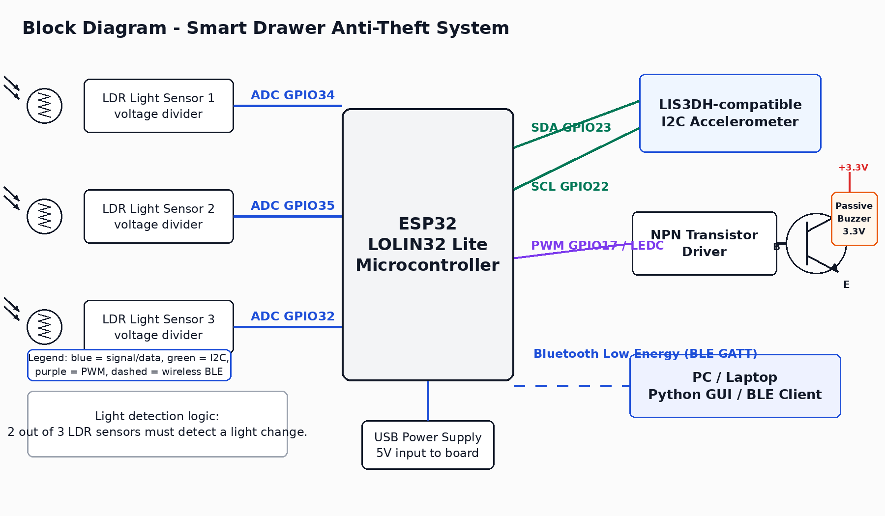
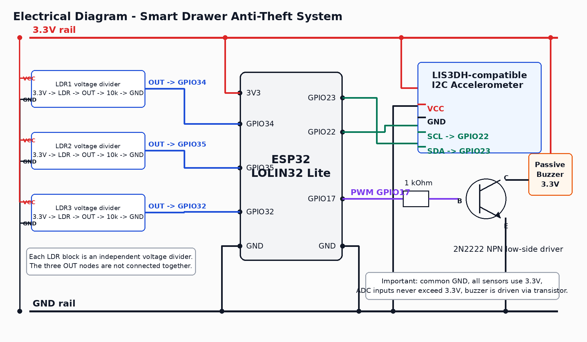

<!-- Generated from descriere_proiect_dokuwiki.txt. Edit the DokuWiki source first if the project page changes. -->

# Smart Drawer Anti-Theft System

## Introduction

The **Smart Drawer Anti-Theft System** is an embedded security system designed to protect a drawer, box, or small storage compartment against unauthorized access. The system uses an ESP32 microcontroller and detects suspicious activity using two complementary methods:

- motion and vibration detection using an I2C accelerometer;
- light detection using three LDR sensors placed inside the protected drawer.

The idea is based on the fact that a closed drawer is normally dark and still. If the drawer is opened, light enters and the LDR readings change. If the drawer or box is moved, the accelerometer detects motion or vibration. When the system is armed and one of these events is detected, the ESP32 activates a passive buzzer and sends a notification to a PC application through Bluetooth Low Energy.

The project is useful because it combines multiple embedded systems concepts in a practical application:

- analog sensor reading using ADC;
- I2C communication with a digital accelerometer;
- PWM control for a passive buzzer;
- transistor-based actuator driving;
- Bluetooth Low Energy communication;
- finite state machine control;
- PC-side monitoring and control using a Python desktop application.

The final goal is to obtain a low-cost, breadboard-compatible anti-theft prototype that can be armed and disarmed remotely and that can detect drawer opening, movement or vibration.

## General Description

The system is built around an **ESP32 LOLIN32 Lite** board. The ESP32 reads the three LDR voltage dividers through ADC pins, communicates with the accelerometer through I2C, controls a passive buzzer through PWM and a 2N2222 transistor, and exposes a BLE GATT service for communication with a PC.

The user interface is implemented as a Python desktop application. The embedded device has no display and no physical keypad. The user can scan for the ESP32 device, connect to it, arm or disarm the system, request status, calibrate sensors and view logs from the GUI.

The system has three main states:

- **DISARMED** - the system does not trigger the alarm. Sensors may still be read for status/debugging. The buzzer is off.
- **ARMED** - the system monitors the accelerometer and the LDR sensors. If motion or light is detected, the system enters the alarm state.
- **ALARM** - the buzzer is active and the ESP32 sends an alarm notification. The system remains in this state until a correct `DISARM <PIN>` command is received.

The main supported commands are:

- `ARM <PIN>`
- `DISARM <PIN>`
- `STATUS`
- `CHANGE_PIN <old_pin> <new_pin>`
- `GET_LOG`
- `CALIBRATE_LIGHT`
- `CALIBRATE_MOTION`
- `PING`

The default PIN used during development is:

```text
1234
```

### Block Diagram



The system contains the following modules:

- **ESP32 LOLIN32 Lite** - central controller, BLE server, sensor reader and alarm controller.
- **LDR sensor module** - three LDR voltage dividers connected to ADC pins.
- **Accelerometer module** - I2C digital accelerometer used for motion/vibration detection.
- **Buzzer driver** - passive buzzer driven through a 2N2222 NPN transistor.
- **BLE communication layer** - command/status/log communication between ESP32 and PC.
- **Python desktop application** - graphical user interface for the user.
- **State machine firmware** - implements DISARMED, ARMED and ALARM behavior.

The three LDR sensors are used for redundancy. The firmware uses a two-out-of-three voting rule for light detection. This reduces false alarms caused by noise or uneven light distribution inside the drawer.

The accelerometer is used to detect motion, vibration or sudden displacement. This is useful because someone may move the drawer or the entire box without fully opening it.

## Hardware Design

### Component List

| Component | Quantity | Role in project |
| --- | --- | --- |
| ESP32 LOLIN32 Lite | 1 | Main microcontroller, BLE communication, sensor reading and alarm control |
| LIS3DH-compatible accelerometer module | 1 | Motion and vibration detection over I2C |
| LDR sensor | 3 | Light detection inside the drawer |
| 10 kOhm resistor | 3 | Fixed resistors for the LDR voltage dividers |
| Passive buzzer | 1 | Acoustic alarm |
| 2N2222 NPN transistor | 1 | Low-side driver for the passive buzzer |
| 1 kOhm resistor | 1 | Base resistor for the 2N2222 transistor |
| Breadboard | 1 | Prototype assembly |
| Jumper wires | as needed | Electrical connections |
| USB cable | 1 | Firmware upload, serial debugging and power during development |
| External USB power bank | 1, optional | Standalone power supply after firmware upload |

### Pin Mapping

| Module / Signal | ESP32 Pin | Reason for choosing this pin |
| --- | --- | --- |
| LDR 1 voltage divider output | GPIO34 | ADC-capable input-only pin, suitable for analog sensing |
| LDR 2 voltage divider output | GPIO35 | ADC-capable input-only pin, suitable for analog sensing |
| LDR 3 voltage divider output | GPIO32 | ADC-capable GPIO, used for the third light sensor |
| Accelerometer SDA | GPIO23 | Custom I2C data pin used by the firmware |
| Accelerometer SCL | GPIO22 | I2C clock pin |
| Buzzer PWM control | GPIO17 | PWM-capable GPIO used to drive the passive buzzer through a transistor |
| Accelerometer VCC | 3.3 V | Sensor power supply compatible with ESP32 logic |
| Accelerometer GND | GND | Common ground |
| LDR voltage dividers VCC | 3.3 V | Keeps ADC voltages within ESP32 limits |
| LDR voltage dividers GND | GND | Common ground |
| Buzzer positive terminal | 3.3 V | Buzzer supply |
| Buzzer negative terminal | 2N2222 collector | Transistor switches the buzzer to ground |

GPIO34 and GPIO35 are input-only pins, which is acceptable for the LDR voltage dividers because the firmware only needs ADC input. GPIO32 is also ADC-capable and is used for the third LDR. GPIO23 and GPIO22 are used as custom I2C pins for the accelerometer. GPIO17 is used for PWM because the buzzer is passive and must be driven with a square wave.

### LDR Voltage Dividers

Each LDR is connected as a voltage divider powered from **3.3 V**:

```text
3.3V ---- LDR ---- ADC_PIN ---- 10 kOhm ---- GND
```

The ADC pins are:

| LDR | ADC pin |
| --- | --- |
| LDR1 | GPIO34 |
| LDR2 | GPIO35 |
| LDR3 | GPIO32 |

The firmware stores a dark baseline during calibration and then checks the absolute difference between the current ADC value and the baseline. This works even if the voltage divider orientation causes the ADC value to decrease instead of increase under light.

The light detection rule is:

```text
lightDetected = at least 2 of 3 LDR sensors changed more than the configured threshold
```

### Accelerometer Connection

The accelerometer module is connected to the ESP32 using I2C:

```text
ESP32 GPIO23  ->  SDA
ESP32 GPIO22  ->  SCL
ESP32 3.3V    ->  VCC
ESP32 GND     ->  GND
```

The firmware performs an I2C scan at startup and reads the `WHO_AM_I` register. During testing, the sensor was detected as:

```text
I2C address: 0x19
WHO_AM_I:   0x33
Type:       LIS3DH-compatible
```

This startup check is important because the accelerometer module appearance was not enough to identify the exact chip with certainty.

### Buzzer Driver

The passive buzzer is controlled through a 2N2222 NPN transistor, not directly from an ESP32 GPIO pin. The ESP32 generates a PWM signal on GPIO17, and the transistor works as a low-side switch:

```text
ESP32 GPIO17 --- 1 kOhm --- 2N2222 base
2N2222 emitter ----------- GND
2N2222 collector --------- buzzer negative terminal
buzzer positive terminal - 3.3 V
```

The buzzer is passive, therefore it requires a PWM/tone signal. The transistor protects the ESP32 GPIO and allows the buzzer current to be switched externally.

### Electrical Diagram



The electrical diagram should show:

- all modules powered from 3.3 V;
- common GND rail for ESP32, sensors and buzzer driver;
- three independent LDR voltage dividers;
- accelerometer connected over I2C on GPIO23/GPIO22;
- buzzer connected through a 2N2222 transistor and a 1 kOhm base resistor;
- no ADC input connected to a voltage higher than 3.3 V.

### Hardware Photos and Evidence

Current Serial Monitor evidence:

```text
Smart Drawer Anti-Theft System boot
[LOG] 221 BOOT
[LOG] 1578 I2C 0x19 accel=LIS3DH-compatible addr=0x19 who=0x33
[LOG] 1579 LDR raw1=939 base1=937 deltaThreshold=450
[LOG] 1864 BLE advertising SmartDrawerAlarm
```

This proves that the ESP32 is running uploaded firmware, the I2C accelerometer is wired correctly, the ADC reading for the LDR circuit is functional and BLE advertising starts successfully.

### Hardware Design Notes

- All sensors are powered from **3.3 V**.
- ADC pins must not receive voltages higher than 3.3 V.
- GPIO34 and GPIO35 are input-only pins, which is suitable for LDR readings.
- The buzzer is controlled through a transistor because it should not be powered directly from an ESP32 GPIO.
- All modules must share a common ground.
- USB is used for firmware upload, serial debugging and power during development.
- After firmware upload, the ESP32 can be powered from an external USB power bank.

### Power and Safety Notes

During development, the ESP32 is powered through the USB cable connected to the laptop. The same cable is used for firmware upload and Serial Monitor debugging. After the firmware has already been uploaded, the board can also be powered from an external USB power bank, because the alarm logic runs directly on the ESP32.

All external sensors are connected to the **3.3 V** rail, not to 5 V. This is important because the ESP32 GPIO and ADC inputs are not 5 V tolerant. The LDR voltage dividers are also powered from 3.3 V, so the ADC input voltage cannot exceed the safe range of the ESP32.

The buzzer is not powered directly from a GPIO pin. GPIO17 only drives the base of the 2N2222 transistor through a 1 kOhm resistor. The transistor switches the buzzer current separately, while all components share a common GND reference.

### Hardware Verification

The hardware was verified incrementally instead of connecting all modules and assuming they work. The bring-up order was:

1. connect the ESP32 through USB and verify firmware upload;
1. open Serial Monitor at 115200 baud and verify the boot message;
1. scan the I2C bus and read the accelerometer `WHO_AM_I` register;
1. verify that at least one LDR ADC value is printed;
1. verify that BLE advertising starts as `SmartDrawerAlarm`;
1. add the remaining LDR voltage dividers on GPIO35 and GPIO32.

The most important hardware proof at this stage is the Serial Monitor output showing:

- firmware boot;
- I2C device detected at `0x19`;
- `WHO_AM_I = 0x33`, corresponding to a LIS3DH-compatible accelerometer;
- LDR raw ADC value;
- BLE advertising started.

The remaining hardware calibration work is threshold tuning. The final light and motion thresholds must be adjusted after the sensors are mounted in their final physical position inside the drawer, because ambient light, sensor placement and drawer movement influence the measured values.

## Software Design

### Development Environment

The firmware is developed using:

- **PlatformIO** inside VS Code;
- **Arduino framework** for ESP32;
- **NimBLE-Arduino** for Bluetooth Low Energy communication;
- **Wire** library for I2C communication.

The PC application is developed in Python and uses:

- **bleak** for BLE client communication;
- **tkinter / ttk** for the desktop GUI;
- JSONL logs for local event recording.

### Library Choices

The selected libraries were chosen to keep the project reliable, understandable and suitable for an ESP32 student prototype:

| Library / tool | Where it is used | Motivation |
| --- | --- | --- |
| Arduino framework | ESP32 firmware | Provides fast development, good ESP32 support and simple access to GPIO, ADC, I2C and PWM functionality. |
| PlatformIO | Firmware build/upload | Gives a reproducible project structure, dependency management and direct support for the LOLIN32 Lite board. |
| NimBLE-Arduino | ESP32 BLE GATT server | Lighter than the classic ESP32 BLE stack and suitable for command/status communication with a PC. |
| Wire | Accelerometer I2C communication | Standard Arduino I2C library, simple and compatible with ESP32 custom SDA/SCL pins. |
| bleak | Python BLE client | Cross-platform BLE client library used to scan, connect, send commands and receive notifications. |
| tkinter / ttk | Python GUI | Included with Python on many systems, avoids heavy GUI dependencies and is enough for a clean desktop control panel. |
| smtplib | Email notification | Python standard library module, used for optional SMTP email alerts without adding another external dependency. |
| PyInstaller | Desktop executable | Allows packaging the Python GUI as a local desktop executable for easier demonstration. |

### Project Novelty

The novelty of the project is not a single sensor or a simple buzzer alarm, but the combination of multiple detection and interaction layers:

- light detection uses **three LDR sensors** instead of one sensor;
- the firmware uses **2-out-of-3 voting** for LDR detection, reducing false alarms caused by one noisy or badly lit sensor;
- motion detection is added using an I2C accelerometer, so the system can detect both drawer opening and physical movement;
- the ESP32 exposes a BLE GATT interface instead of requiring a serial cable for normal use;
- the user controls the system through a Python GUI instead of manually typing BLE commands;
- the laptop application can optionally send one email alert per alarm session.

This makes the project closer to a complete smart security prototype than to a single-sensor lab exercise.

### Laboratory Concepts Used

| Laboratory / course reference | Concept / functionality | Usage in project |
| --- | --- | --- |
| Laboratory 0 | GPIO | GPIO pins are used both for reading sensor signals and for controlling the 2N2222 transistor driver connected to the passive buzzer. |
| Laboratory 3 | PWM / timer-based output | The passive buzzer is driven with PWM tones on GPIO17. Because the buzzer is passive, it needs a generated square-wave signal instead of a simple HIGH/LOW output. |
| Laboratory 3 | Interrupts / timing / non-blocking logic | The firmware uses `millis()`-based timing instead of blocking delays for periodic sensor polling, periodic BLE status notifications and the buzzer alarm pattern. This keeps the firmware responsive while the alarm is active. |
| Laboratory 4 | ADC | The three LDR voltage dividers are read through ESP32 ADC pins GPIO34, GPIO35 and GPIO32. The ADC readings are used to detect light changes when the drawer is opened. |
| Laboratory 6 | I2C | The accelerometer is detected and read over I2C using SDA on GPIO23 and SCL on GPIO22. The firmware scans the I2C bus and reads the `WHO_AM_I` register to identify the sensor. |
| Course 9 | Communication / BLE extension | The ESP32 communicates with the PC application using BLE GATT characteristics. BLE is used as an ESP32-specific wireless communication extension, related to the wireless communication concepts presented in Course 9 on OCW. |
| Project software architecture | State machine | The firmware logic is organized around the `DISARMED`, `ARMED` and `ALARM` states. State transitions are triggered by valid BLE commands, motion detection or light detection. |
| Project software extension | PC-side application | A Python GUI is used for user interaction, live status display, event logs, diagnostics and optional email notifications. |


### Firmware Architecture

The firmware is organized into multiple modules:

| Module | Responsibility |
| --- | --- |
| `SmartDrawerAlarm.ino` | Main setup and loop |
| `config.h` | Constants, BLE UUIDs and thresholds |
| `pins.h` | Hardware pin mapping |
| `ldr_sensor.*` | LDR reading, averaging, calibration and voting |
| `accel_sensor.*` | I2C scan, accelerometer identification and motion detection |
| `alarm_buzzer.*` | Non-blocking PWM alarm pattern |
| `state_machine.*` | DISARMED / ARMED / ALARM transitions |
| `ble_service.*` | BLE GATT server and command reception |
| `event_log.*` | In-memory event log |

The main state machine is:

```text
DISARMED -> ARMED
    condition: ARM <PIN> with correct PIN

ARMED -> ALARM
    condition: light detected by at least 2 LDRs or motion detected

ARMED -> DISARMED
    condition: DISARM <PIN> with correct PIN

ALARM -> DISARMED
    condition: DISARM <PIN> with correct PIN
```

The alarm remains active until the correct PIN is received.

The main firmware file creates one object for each subsystem:

```text
EventLogger logger;
LdrSensorArray ldrSensors;
MotionSensor motionSensor;
BuzzerController buzzer;
SecurityStateMachine security;
BleCommandService ble;
```

This keeps the firmware modular. Sensor code, BLE communication, buzzer control and state transitions are separated into different files instead of being written as one long sketch.

The firmware startup sequence is:

1. start Serial at 115200 baud;
1. initialize the event logger;
1. configure the buzzer PWM output;
1. configure and calibrate the LDR sensors;
1. initialize I2C and identify the accelerometer;
1. start the BLE GATT service;
1. publish the initial status and log messages.

The main loop is intentionally short:

```text
buzzer.update();
pollSensors periodically;
notify status periodically;
```

The firmware avoids long blocking loops during normal operation. Sensor polling is controlled with `millis()` using `SENSOR_POLL_INTERVAL_MS`, and periodic status messages use `STATUS_NOTIFY_INTERVAL_MS`. This allows BLE commands to remain responsive while the system is armed or while the buzzer is active.

### Command Handling

The ESP32 receives commands through the BLE command characteristic. The command handler normalizes the command, extracts tokens and then executes the requested action.

For `ARM <PIN>`, the firmware:

1. checks the PIN;
1. calibrates the LDR dark baseline;
1. calibrates the accelerometer baseline;
1. switches the state machine to `ARMED`;
1. stops the buzzer in case it was active;
1. sends `OK ARMED`.

For `DISARM <PIN>`, the firmware:

1. checks the PIN;
1. switches the state machine to `DISARMED`;
1. stops the buzzer;
1. sends `OK DISARMED`.

For calibration commands, the firmware recalculates baselines and returns a status string with the current sensor information. For invalid commands or wrong PINs, the firmware returns explicit error messages such as `ERR WRONG_PIN` or `ERR INVALID_COMMAND`.

### Sensor Algorithms

The LDR sensors are calibrated by measuring the dark baseline. After calibration, each sensor is checked using:

```text
detected[i] = abs(current_value[i] - baseline[i]) > threshold
```

The three-sensor voting rule is:

```text
lightDetected = count(detected sensors) >= 2
```

The firmware uses `ACTIVE_LDR_COUNT = 3` and `LIGHT_VOTE_REQUIRED = 2`. This means that one noisy LDR is not enough to trigger the alarm. At least two sensors must detect a significant light change. Each LDR reading is averaged over multiple ADC samples, which reduces small fluctuations.

The LDR threshold is currently:

```text
LIGHT_THRESHOLD_DELTA = 450
```

This value is a starting point and must be tuned experimentally for the final drawer, because the raw ADC values depend on the physical placement of the sensors and the amount of ambient light.

The accelerometer is calibrated by reading the baseline acceleration magnitude while the drawer is still. Motion is detected by comparing the current magnitude with the baseline:

```text
magnitude = sqrt(x*x + y*y + z*z)
delta = abs(magnitude - baselineMagnitude)
motionDetected = delta > threshold
```

At startup, the firmware does not assume the accelerometer type only from the physical module. It scans all I2C addresses, reads register `0x0F` and classifies known `WHO_AM_I` values:

| WHO_AM_I | Detected type |
| --- | --- |
| `0x3F` | LIS3DSH |
| `0x32` | H3LIS331DL |
| `0x33` | LIS3DH-compatible |

The detected module currently reports `0x33`, so the firmware treats it as LIS3DH-compatible. The motion threshold is currently:

```text
MOTION_THRESHOLD_RAW = 1800.0
```

This threshold must also be tuned experimentally after the accelerometer is fixed in the final drawer position.

### Buzzer Control

The buzzer is passive, so the firmware uses PWM. The alarm pattern is non-blocking and uses `millis()` timing:

```text
1000 Hz for 200 ms
pause for 100 ms
1500 Hz for 200 ms
pause for 300 ms
repeat until DISARM
```

This avoids blocking the firmware loop, so BLE commands and sensor reads can continue while the buzzer is active.

The buzzer state machine is separate from the main security state machine. When the alarm is triggered, the firmware calls `buzzer.setAlarmActive(true)`. After that, `buzzer.update()` is called continuously from the main loop and advances the pattern based on elapsed time. When a valid `DISARM` command is received, `buzzer.stop()` immediately turns the PWM duty cycle off.

### BLE Protocol

The ESP32 advertises as:

```text
SmartDrawerAlarm
```

BLE service UUID:

```text
12345678-1234-5678-1234-56789abcdef0
```

BLE characteristics:

| Characteristic | UUID | Direction |
| --- | --- | --- |
| Command RX | `12345678-1234-5678-1234-56789abcdef1` | PC to ESP32, WRITE |
| Status TX | `12345678-1234-5678-1234-56789abcdef2` | ESP32 to PC, READ + NOTIFY |
| Event Log TX | `12345678-1234-5678-1234-56789abcdef3` | ESP32 to PC, READ + NOTIFY |

Supported commands:

```text
ARM <PIN>
DISARM <PIN>
STATUS
CHANGE_PIN <old_pin> <new_pin>
GET_LOG
CALIBRATE_LIGHT
CALIBRATE_MOTION
PING
```

Example responses:

```text
OK ARMED
OK DISARMED
ERR WRONG_PIN
ERR INVALID_COMMAND
STATUS DISARMED
STATUS ARMED
STATUS ALARM
ALARM LIGHT
ALARM MOTION
ALARM LIGHT_AND_MOTION
PONG
```

Status messages include the current state, alarm reason, BLE connection state, detected accelerometer type and LDR values. This makes debugging easier because the PC application can show live information without requiring Serial Monitor.

Example status message format:

```text
STATUS ARMED reason=NONE ble=connected accel=LIS3DH-compatible who=0x33 LDR raw1=... base1=... raw2=... base2=... raw3=... base3=... deltaThreshold=450
```

When a client disconnects, the ESP32 restarts BLE advertising, so the PC application can reconnect without resetting the board.

### Python Desktop Application

The Python GUI replaces the manual command-line workflow. It provides:

- BLE scan and connect/disconnect controls;
- manual BLE address input if scanning is unreliable;
- PIN input;
- ARM, DISARM and STATUS buttons;
- CHANGE PIN form;
- live state display with DISARMED / ARMED / ALARM badge;
- sensor/status values parsed from firmware messages;
- diagnostics buttons for PING and calibration;
- event log panel with timestamps;
- mock mode for testing without the ESP32;
- optional email notification when an alarm is detected;
- a Linux desktop executable and launcher for running the application without manually typing Python commands.

The GUI communicates with the ESP32 over BLE. USB is used only for firmware upload, serial debugging and power during development.

The email notification feature is implemented only on the PC side. The ESP32 does not store email credentials and does not connect to Wi-Fi. When the GUI receives an `ALARM` event through BLE, it can send one email through an SMTP server. The application sends only one email per alarm session, then resets this protection after the system leaves the `ALARM` state, normally after a valid `DISARM` command.

The GUI also has a mock mode. This allows the interface, buttons, logs and alarm behavior to be tested without the physical ESP32 connected.

The desktop executable was generated with PyInstaller. On Linux, the application can be started using a `.desktop` launcher and a custom project icon.

### Optimizations

Several optimizations were applied in the firmware and PC application:

- The buzzer pattern is non-blocking and uses `millis()`, so the ESP32 can still process BLE commands while the alarm is active.
- Sensor polling is periodic instead of continuously blocking the main loop.
- Status notifications are sent periodically, not on every loop iteration.
- LDR readings are averaged over multiple ADC samples to reduce noise.
- The 2-out-of-3 LDR voting rule reduces false alarms caused by one unstable sensor.
- NimBLE-Arduino was chosen because it uses fewer resources than the classic ESP32 BLE stack.
- The firmware is split into modules, which makes each subsystem easier to test and modify.
- The Python GUI uses a background worker thread for BLE operations, so scanning and commands do not freeze the interface.
- Email alerts are handled on the laptop, not on the ESP32, avoiding Wi-Fi configuration and credential storage on the microcontroller.

## Obtained Results

Current verified results:

- The firmware builds successfully in PlatformIO for **WEMOS LOLIN32 Lite**.
- The firmware was uploaded to the ESP32 through USB.
- The Serial Monitor shows that the firmware boots correctly.
- The accelerometer is detected over I2C at address `0x19`.
- The accelerometer `WHO_AM_I` value is `0x33`, indicating a LIS3DH-compatible device.
- LDR ADC readings are visible in the Serial Monitor.
- BLE advertising starts with the device name `SmartDrawerAlarm`.
- The Python GUI application was implemented for controlling and monitoring the system.
- A mock mode was implemented so the GUI can be tested without physical hardware.
- The GUI supports optional email alerts for alarm events.
- A local Linux desktop executable and launcher were generated for easier demo usage.
- The project source code was uploaded to GitHub.

Example Serial Monitor output:

```text
Smart Drawer Anti-Theft System boot
[LOG] 221 BOOT
[LOG] 1578 I2C 0x19 accel=LIS3DH-compatible addr=0x19 who=0x33
[LOG] 1579 LDR raw1=939 base1=937 deltaThreshold=450
[LOG] 1864 BLE advertising SmartDrawerAlarm
```

Tests still to be completed or tuned:

- final light threshold tuning for all three LDRs;
- final motion threshold tuning after mounting the system in the drawer;
- complete alarm demonstration using the passive buzzer;
- long-term BLE reconnect stability test;
- real SMTP email delivery test with the final email account.


## Conclusions

The project currently has a working hardware prototype, modular ESP32 firmware and a Python desktop GUI. The ESP32 can boot the uploaded firmware, detect the accelerometer through I2C, read LDR values and advertise through BLE. The firmware implements the planned security states, sensor logic, BLE command protocol and buzzer alarm pattern.

The most important design decision was to combine two detection methods: light detection using three LDR sensors and motion detection using an accelerometer. This improves reliability compared to using only one sensor type.

Future improvements may include persistent PIN storage in ESP32 NVS, better threshold calibration tools, a cleaner final enclosure and more extensive long-term BLE stability testing.

## Source Code and Other GitHub Resources

The project source code is available at:

- https://github.com/MarinescuCalin/Smart-Drawer-Anti-Theft-System

Main project structure:

```text
firmware/SmartDrawerAlarm/     ESP32 firmware
pc_app/smart_drawer_client/    Python BLE CLI client
pc_app/smart_drawer_gui/       Python desktop GUI
assets/icons/                  Application icons
packaging/linux/               Linux desktop launcher
tools/                         Build scripts
platformio.ini                 PlatformIO project configuration
tutorial.md                    Short run tutorial
```

Important run/build commands:

```text
pio run
pio run -t upload
pio device monitor --baud 115200

cd pc_app
source .venv/bin/activate
python -m smart_drawer_gui.main_gui
python -m smart_drawer_gui.main_gui --mock

cd ..
tools/build_gui_executable.sh
```

## Journal

| Date | Progress |
| --- | --- |
| 2026-05-08 | Initial OCW project page created with project idea, block diagram and first hardware description. |
| 2026-05-15 | Hardware pin mapping was finalized for ESP32 LOLIN32 Lite: LDRs on GPIO34/GPIO35/GPIO32, I2C on GPIO23/GPIO22 and buzzer PWM on GPIO17. |
| 2026-05-15 | ESP32 firmware smoke test was uploaded successfully through USB using PlatformIO. |
| 2026-05-15 | Serial Monitor confirmed accelerometer detection at I2C address 0x19 with WHO_AM_I value 0x33. |
| 2026-05-15 | Three LDR voltage divider connections were added on the breadboard. |
| 2026-05-15 | Modular ESP32 firmware was implemented: state machine, BLE service, LDR sensing, accelerometer sensing, buzzer control and event log. |
| 2026-05-15 | PlatformIO configuration was added for LOLIN32 Lite and the firmware build succeeded. |
| 2026-05-15 | Python BLE CLI and Python desktop GUI were implemented for PC-side control. |
| 2026-05-16 | Project files were uploaded to GitHub. |
| 2026-05-22 | Optional GUI email alert support was added. The email is sent by the laptop application when an ALARM event is received. |
| 2026-05-22 | A transparent application icon, PyInstaller build script and Linux desktop launcher were added. |
| 2026-05-22 | The GUI left-side panel was made scrollable so all controls, including Email Alert, remain accessible on smaller screens. |

## Bibliography/Resources

- ESP32 LOLIN32 Lite PlatformIO board documentation: https://docs.platformio.org/en/stable/boards/espressif32/lolin32_lite.html
- ESP32 LOLIN32 Lite pinout reference: https://www.mischianti.org/2021/07/30/esp32-wemos-lolin32-lite-high-resolution-pinout-and-specs/
- NimBLE-Arduino documentation: https://h2zero.github.io/NimBLE-Arduino/
- Bleak documentation: https://bleak.readthedocs.io/
- Python smtplib documentation: https://docs.python.org/3/library/smtplib.html
- PyInstaller documentation: https://pyinstaller.org/
- ST LIS3DH datasheet: https://www.st.com/resource/en/datasheet/lis3dh.pdf
- ST LIS3DSH datasheet: https://www.st.com/resource/en/datasheet/lis3dsh.pdf
- ST H3LIS331DL datasheet: https://www.st.com/resource/en/datasheet/h3lis331dl.pdf
- DokuWiki syntax reference: https://ocw.cs.pub.ro/courses/wiki/syntax
- PM project template: https://ocw.cs.pub.ro/courses/pm/pm/prj2021/template
